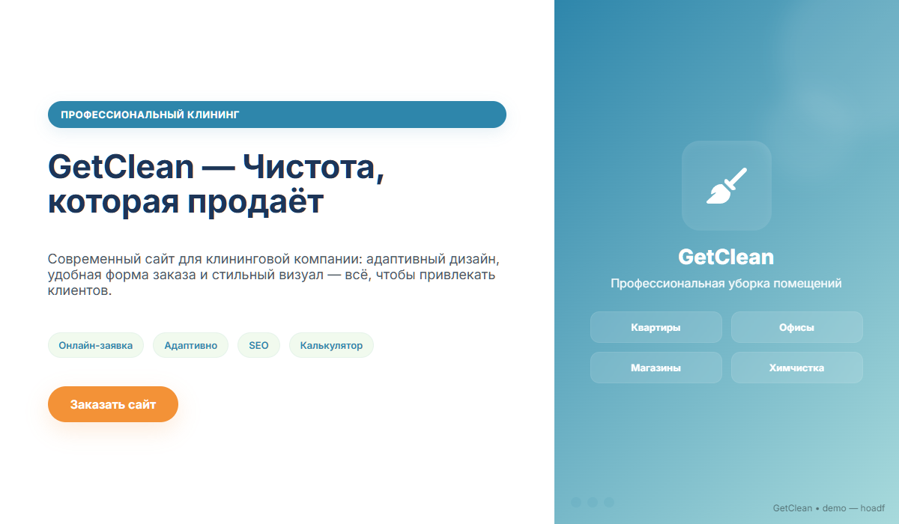
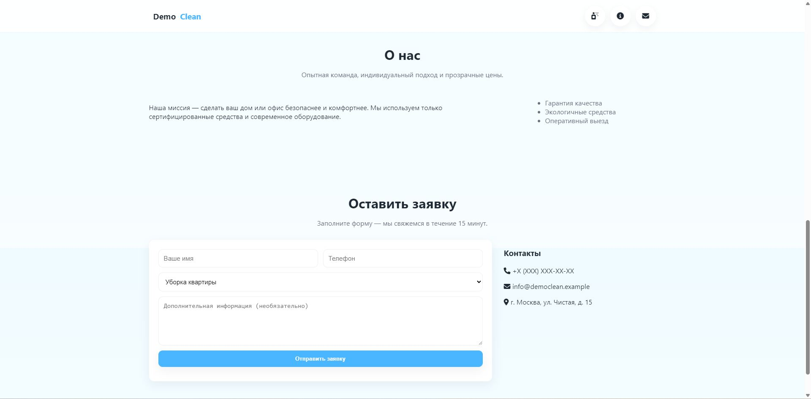
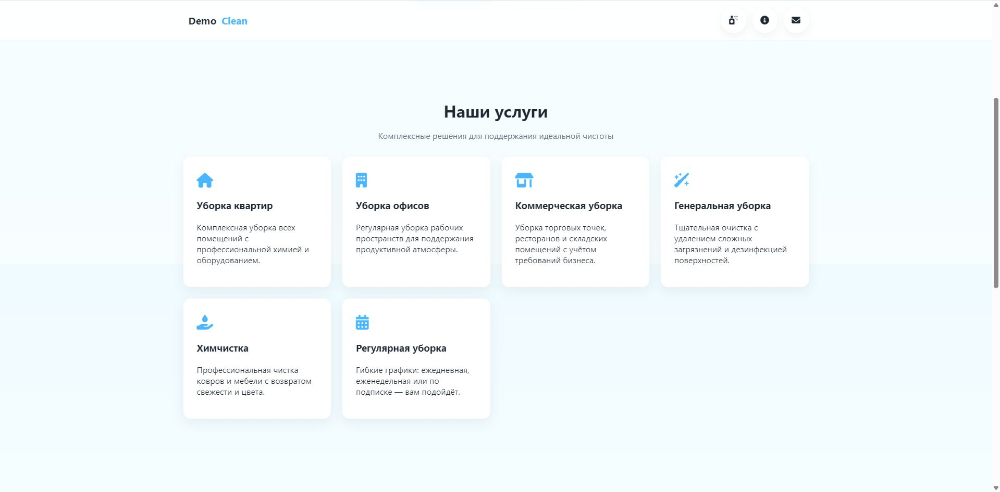
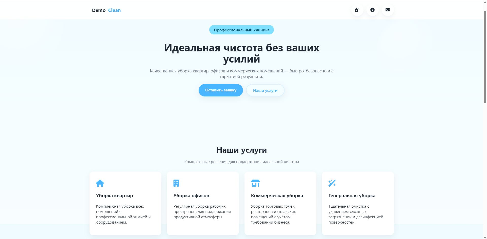

# 🫧 DemoClean — Демо сайт клининговой компании

Демонстрационный сайт компании, предоставляющей **профессиональные клининговые услуги** для квартир, офисов и коммерческих помещений.  
Создан в учебных и демонстрационных целях для показа структуры адаптивного корпоративного лендинга и современных визуальных приёмов дизайна.

🔗 **Онлайн демо:** [Посмотреть на GitHub Pages](https://hoadf.github.io/DemoClean/)  
💾 **Исходный код:** [Репозиторий на GitHub](https://github.com/hoadf/DemoClean)

---

## 🖼️ Превью

---

## 📸 Скриншоты

| Главная | Услуги | Контакты |
|----------|---------|-----------|
|  |  |  |

---

## 💡 О проекте

**DemoClean** — демонстрационный проект сайта клининговой компании.  
Он показывает пример современного лендинга с чистой композицией, «воздушным» стилем и лёгкими анимациями пузырьков на фоне.

Основные разделы сайта:
- интерактивное **меню в виде пузырьков**;
- **геро-блок** с рекламным слоганом и кнопками действий;
- блок **услуг** с карточками и иконками;
- секция **о компании** и преимущества;
- **форма обратной связи** с валидацией на JavaScript;
- **адаптивная вёрстка** для мобильных и планшетов.

---

## 🧩 Технологии

- **HTML5** — семантическая структура и разметка  
- **CSS3 (Flexbox / Grid)** — адаптивная вёрстка и визуальные эффекты (пузырьки, плавные тени)  
- **Vanilla JavaScript (ES6)** — плавная прокрутка, обработка формы и динамика элементов  

---

## 🖥️ Особенности

- Меню в виде **плавающих пузырей**, реагирующих на курсор  
- **Плавные переходы и анимации** при наведении  
- Минималистичный, «чистый» дизайн с голубыми акцентами  
- Отдельный **геро-блок** с мягкими подсветками и градиентами  
- Рабочая форма обратной связи (демо, без сервера)  
- Полная **адаптивность под мобильные устройства**

---

## 📤 Хостинг

Сайт размещён на **GitHub Pages**  
и работает локально без серверной части.  
Для публикации достаточно активировать Pages в настройках репозитория.

---

## 📄 Лицензия

Проект распространяется под лицензией [MIT](LICENSE).  
Разрешено использование кода в **учебных и демонстрационных целях** с указанием автора.

---

✉️ **Автор проекта:** *HOADF*  
💬 **Направление:** веб-разработка, AI-интеграции, визуальные интерфейсы и автоматизация.
